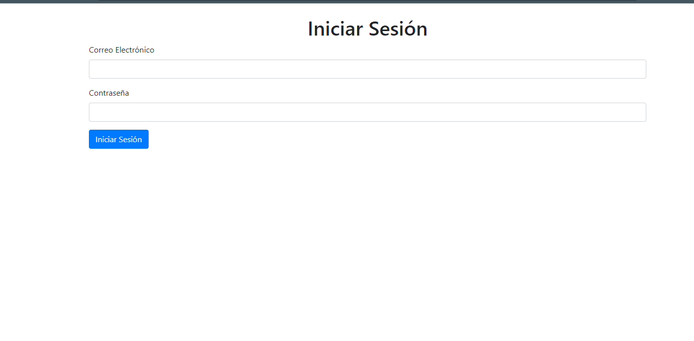
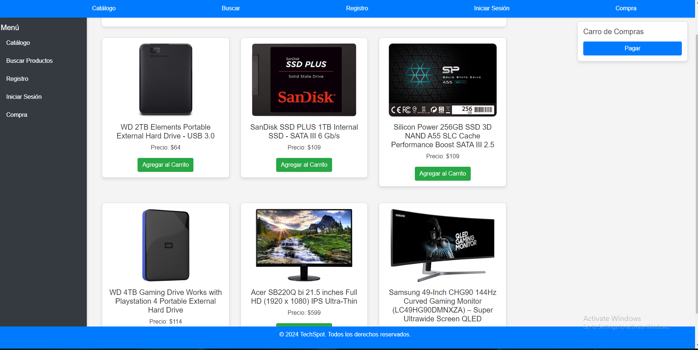
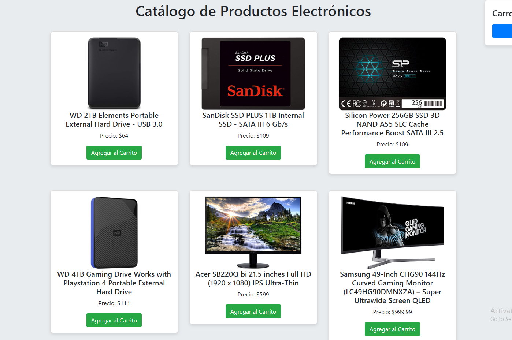
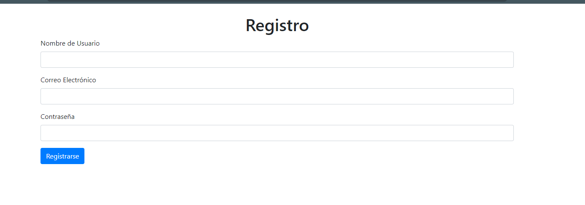

# TechSpot - Catálogo de Productos

## Descripción

TechSpot es un sitio web para una tienda de electrónicos que muestra un catálogo de productos y permite a los usuarios agregar productos a un carrito de compras. La aplicación utiliza HTML, CSS, Bootstrap y JavaScript para la interfaz, y se basa en la FakeStoreAPI para obtener datos de productos de manera simulada.

## Estructura del Proyecto

El proyecto tiene la siguiente estructura de carpetas:

desarrollo_ii-main/
├── epe_1/
├── components/
├── header.html
├── footer.html
└── sidenav.html
├── page/
├── plugins/
└── index.html

- **components/**: Carpeta que contiene los archivos de componentes HTML (header, footer y sidenav).
- **page/**: Carpeta para otras páginas si es necesario en el futuro.
- **plugins/**: Carpeta para scripts y plugins adicionales.
- **index.html**: Página principal del catálogo de productos.

Uso
Al abrir el archivo index.html, verás el catálogo de productos electrónicos. Puedes ver los productos ordenados por precio y agregar productos al carrito de compras. La funcionalidad de pago está en desarrollo.

Componentes
header.html: Encabezado del sitio.
footer.html: Pie de página del sitio.
sidenav.html: Barra de navegación lateral.
Estos componentes se incluyen en index.html mediante las funciones de fetch y innerHTML para ensamblar el contenido dinámicamente.

Licencia
Este proyecto está licenciado bajo la Licencia MIT.

Tecnologías
HTML5
CSS3
Bootstrap 4
JavaScript
jQuery
FakeStoreAPI para datos de productos.
Dejo acontinuacion capturas de este proyecto 

